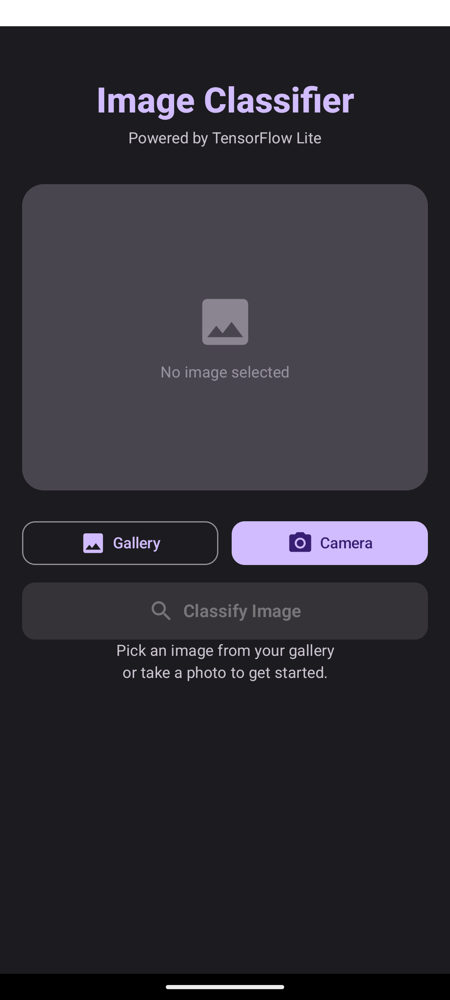
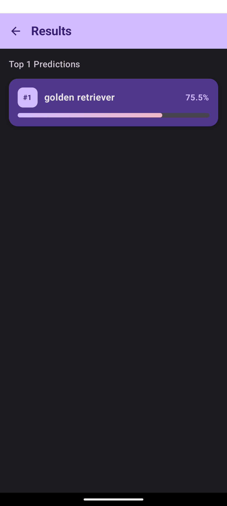

# TFImageClassifier

An on-device image classification app for Android. Pick an image from the gallery or capture one with the camera, and the app classifies it locally using a MobileNet v1 model running on TensorFlow Lite — no network connection required.

## Screenshots

| Home | Result |
|:---:|:---:|
|  |  |

## Features

- 📷 Classify images from the **camera** or **gallery**
- ⚡ Fully **on-device inference** with TensorFlow Lite (MobileNet v1, 224×224 input)
- 🎨 Modern UI built with **Jetpack Compose** and Material 3
- 🧭 In-app navigation with **Navigation Compose** (Home → Result screens)
- 💉 Dependency injection with **Hilt**

## Tech Stack

| Layer | Technology |
|---|---|
| UI | Jetpack Compose, Material 3, Navigation Compose |
| DI | Hilt (Dagger) |
| ML | TensorFlow Lite + TFLite Support Library |
| Async | Kotlin Coroutines |
| Image loading | Coil |
| Permissions | Accompanist Permissions |

## Architecture

The project follows Clean Architecture with an MVVM presentation layer:

```
app/src/main/java/com/example/tfimageclassifier/
├── data/
│   ├── local/            # TFLiteImageClassifier — model loading & inference
│   └── repository/       # ImageClassifierRepositoryImpl
├── domain/
│   ├── model/            # ClassificationResult
│   ├── repository/       # ImageClassifierRepository (interface)
│   └── usecase/          # ClassifyImageUseCase
├── di/                   # Hilt modules
└── presentation/
    ├── navigation/       # AppNavGraph, Screen routes
    ├── ui/               # HomeScreen, ResultScreen
    ├── viewmodel/        # ClassifierViewModel + ClassifierUiState
    └── theme/
```

**Flow:** the user selects/captures an image → `ClassifierViewModel` invokes `ClassifyImageUseCase` → the repository delegates to `TFLiteImageClassifier`, which resizes the bitmap to 224×224, normalizes it, runs the interpreter, and maps output probabilities to labels → results are exposed as a `ClassifierUiState` and rendered on the Result screen.

## Model

- **Model:** `app/src/main/assets/mobilenet_v1.tflite`
- **Labels:** `app/src/main/assets/labels.txt`

To swap in a different classification model, replace these two files and adjust `INPUT_SIZE` in `TFLiteImageClassifier` if the model expects a different input dimension.

## Requirements

- Android Studio (Iguana or newer recommended)
- JDK 17
- Android SDK 34 (min SDK 24)

## Getting Started

1. Clone the repository:
   ```bash
   git clone https://github.com/emburaan/TFImageClassifier.git
   ```
2. Open the project in Android Studio and let Gradle sync.
3. Run the `app` configuration on a device or emulator (API 24+).

Or build from the command line:

```bash
./gradlew assembleDebug
```